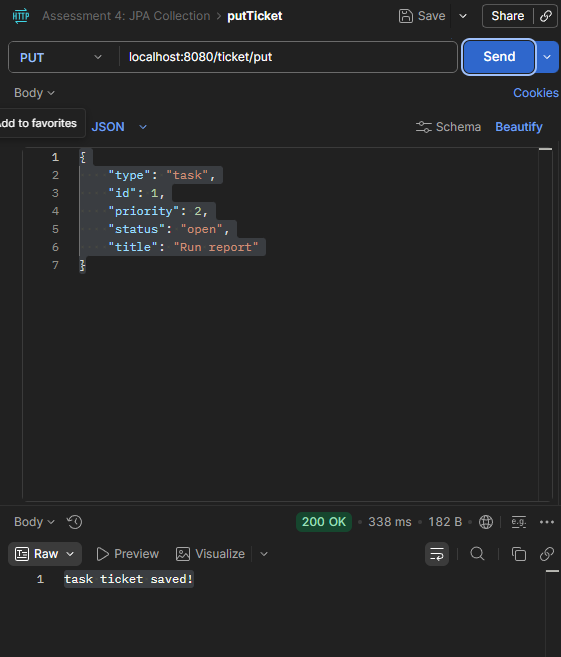
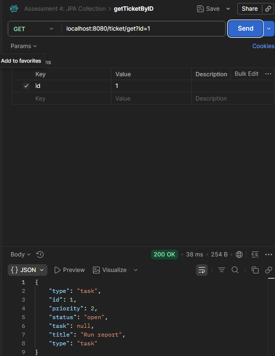
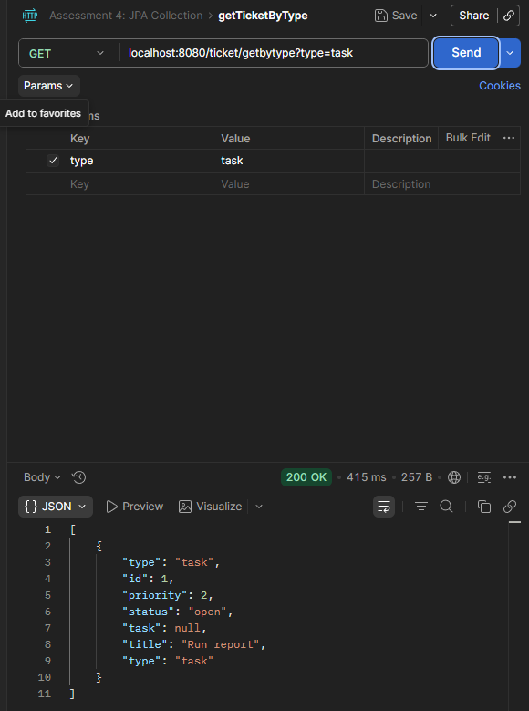
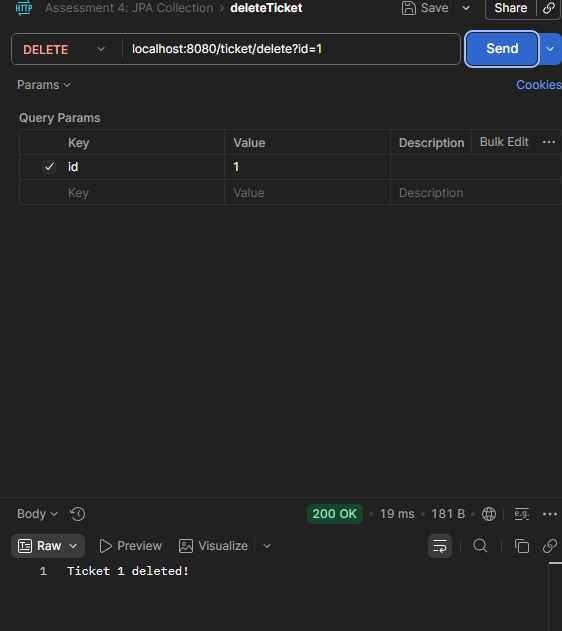
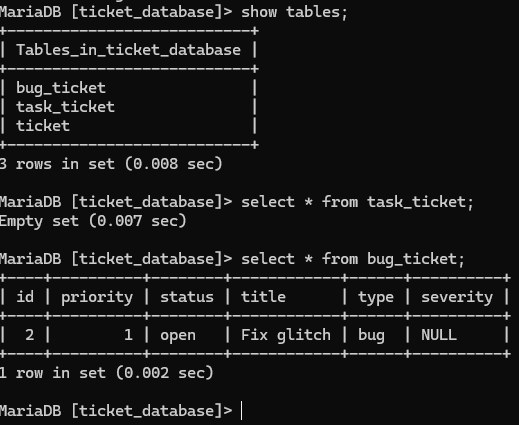

# Spring Boot JPA Ticket Service

A RESTful Java web service built with Spring Boot, JPA, Hibernate, and MariaDB for managing support tickets.

## Overview

This project demonstrates how to build a REST API that performs CRUD operations against a relational database using Java Persistence API (JPA). The service allows users to create, retrieve, filter, and delete support tickets stored in a MariaDB database.

## Features

- Create support tickets
- Retrieve ticket by ID
- Retrieve tickets by type
- Delete ticket by ID
- Persist ticket data in MariaDB
- Demonstrates JPA inheritance and polymorphism
- Uses Spring Data JPA repositories

## Tech Stack

- Java
- Spring Boot
- Spring Web
- Spring Data JPA
- Hibernate
- MariaDB
- Maven
- Postman

## API Endpoints

### Create Ticket
`PUT /ticket/put`

## API Demo

### Create Ticket Request in Postman

### Get Ticket by ID
`GET /ticket/get?id=1`

### Get Tickets by Type
`GET /ticket/getbytype?type=task`

### Delete Ticket
`DELETE /ticket/delete?id=1`

## Database

This project uses a MariaDB database named:

`ticket_database`

## Database Demo

### Stored Ticket Records in MariaDB

JPA handles persistence and maps Java objects directly to relational tables.

## Learning Outcomes

This project demonstrates:

- REST API development with Spring Boot
- Database persistence with JPA
- Entity inheritance and polymorphism
- Repository pattern with Spring Data JPA
- Integration with MariaDB

## Author

Khalil Taylor
